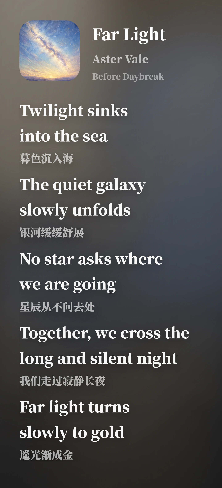

<div align="center">

# Lyric Card Generator

### 在 Android 上制作高质感歌词分享卡片

**网易云音乐导入 · 六步卡片编辑 · 离线实时预览 · 高清 PNG 导出**

<p>
  <strong>语言</strong><br/>
  <strong>简体中文</strong> ·
  <a href="./README.en.md">English</a>
</p>

<p>
  <strong>导航</strong><br/>
  <a href="https://github.com/Qrzzzz/lyrics-card-generator-android/releases/latest">下载最新版</a> ·
  <a href="#主要功能">主要功能</a> ·
  <a href="#使用方式">使用方式</a> ·
  <a href="#本地开发">本地开发</a> ·
  <a href="https://github.com/Qrzzzz/lyrics-card-generator-android/blob/main/PRIVACY.md">隐私说明</a> ·
  <a href="./LICENSE">许可证</a>
</p>


[](https://github.com/Qrzzzz/lyrics-card-generator-android/releases/latest)

</div>

---

<details open>
<summary><strong>✨ 成品参照</strong></summary>

<table>
  <tr>
    <td width="50%" align="center" valign="top"><sub><b>无翻译 · 中文</b></sub><br/></td>
    <td width="50%" align="center" valign="top"><sub><b>有翻译 · 英文原文 + 中文译文</b></sub><br/></td>
  </tr>
</table>

以上图片由 [Lyrics Card Generator 桌面版](https://github.com/Qrzzzz/lyrics-card-generator) 导出，作为卡片设计与排版效果参照。Android 版内置兼容的 React/CSS Renderer，以保持一致的视觉语言与输出合同。

</details>

## 📦 下载与安装

请前往 [GitHub Releases](https://github.com/Qrzzzz/lyrics-card-generator-android/releases/latest) 下载最新版：

- 普通用户请下载 `.apk` 文件并按系统提示安装；
- `.aab` 面向应用分发与发布验证，不能直接在手机上安装；
- 运行需要 Android 8.0（API 26）或更高版本，以及可用的 Android System WebView。

从浏览器侧载 APK 时，Android 可能要求你为当前下载来源临时开启“安装未知应用”权限。安装完成后可以关闭该权限。

<a id="主要功能"></a>

## ✨ 主要功能

### 🎨 卡片编辑与排版

- 按“选歌、歌词、布局、字体、视觉、导出”六步完成卡片制作；
- 支持歌词原文、翻译、纯音乐文案，以及横版、竖版和自动尺寸布局；
- 支持思源黑体 / 思源宋体、字号、字距、行高、对齐、文字颜色与边框调整；
- 支持封面取色、渐变背景、网格密度、平台标识、分享人和生成水印。

### 🎵 歌曲信息与封面

- 支持手动填写歌名、艺人、专辑、歌词与翻译；
- 支持通过网易云音乐搜索歌曲，导入歌曲信息、歌词和封面；
- 支持粘贴网易云音乐歌曲链接或分享文本进行解析；
- 支持通过 Android 系统文件选择器导入本地封面。

### 🗂️ 本地项目管理

- 创建空白或示例项目，并在首页复制、重命名和删除项目；
- 使用 Room 在本机保存项目，支持自动保存与 50 步撤销 / 重做；
- 在配置变化或进程重建后按项目恢复编辑状态；
- 维护封面引用、缩略图与导出缓存，并清理中断后遗留的临时文件。

### 🖼️ 预览、导出与分享

- 从第三步开始按需启动实时预览，后续步骤与导出过程复用同一 Renderer 会话；
- 使用 APK 内置的本地 React/CSS Renderer，不依赖远程网页；
- 支持 1× / 2× 高清 PNG 导出；
- 支持通过系统文件选择器保存，或通过 Android 分享面板发送到其他应用。

### 🌓 Android 体验

- 原生 Jetpack Compose 界面，支持紧凑、中等与展开布局；
- 支持跟随系统、浅色和深色主题；
- 仅申请联网权限，不申请广泛存储权限；文件导入与导出均交由 Android 系统选择器处理。

## 🔒 离线使用与隐私

手动编辑、项目管理、卡片预览和 PNG 导出均可离线完成。只有在你主动搜索或解析网易云音乐内容、获取歌词或下载所选封面时，Native 客户端才会发起受限的 HTTPS 请求。

Renderer WebView 禁止网络访问、外部导航、文件访问和混合内容。应用不包含分析、追踪、广告、遥测或崩溃上报 SDK；项目、封面和导出缓存保存在设备本地，并明确排除在 Android 云备份和换机迁移之外。完整说明见 [PRIVACY.md](https://github.com/Qrzzzz/lyrics-card-generator-android/blob/main/PRIVACY.md)。

<a id="使用方式"></a>

## 🚀 使用方式

1. 新建空白项目，或从示例项目开始。
2. 搜索网易云音乐、粘贴歌曲链接，或手动填写歌曲信息并选择封面。
3. 编辑歌词与翻译，选择合适的内容模式。
4. 调整画布布局、字体方案和视觉样式，并查看实时预览。
5. 选择 1× 或 2×，导出 PNG。
6. 将图片保存到指定位置，或直接分享到其他应用。

<a id="本地开发"></a>

## 🛠️ 本地开发

### 环境要求

- JDK 17；
- Node.js 20 或更高版本；
- Android SDK Platform 36.1；
- Android SDK Build Tools 36.1.0。

### Windows

```powershell
$env:JAVA_HOME = 'C:\path\to\jdk-17'
$env:ANDROID_HOME = "$env:LOCALAPPDATA\Android\Sdk"
$env:ANDROID_SDK_ROOT = $env:ANDROID_HOME

cd renderer
npm.cmd ci
npm.cmd run check

cd ..
.\gradlew.bat :app:test :app:lintProductionRelease :app:assembleAlphaDebug --no-parallel
```

Gradle/JVM test worker 在 Windows 的非 ASCII 仓库路径中可能错误解码 classpath，表现为所有测试类同时 `ClassNotFoundException`。不要跳过测试，也不要把 junction 当作修复。请先提交需要验证的改动，然后从原仓库路径运行受控 wrapper；它会把精确 `HEAD` 放入临时的真实 ASCII detached worktree，安装锁定的 Renderer 依赖，执行原始 Gradle 参数，传播退出码，并清理 staging worktree：

```powershell
.\scripts\gradle-via-ascii-worktree.ps1 -GradleArguments @(
    ':app:test',
    ':app:lintProductionRelease',
    ':app:assembleAlphaDebug',
    '--no-parallel',
    '--no-daemon',
    '--rerun-tasks',
    '--stacktrace',
    '--console=plain'
)
```

wrapper 默认使用 `JAVA_HOME` 和 `ANDROID_HOME`（或 `ANDROID_SDK_ROOT`）。默认 staging root 是系统临时目录下的 `lyrics-card-gradle-staging`；如果该路径本身包含非 ASCII 字符，请通过 `-StagingRoot C:\an-ascii-path` 指定真实 ASCII 目录。为避免验证错对象，工作树有未提交改动时 wrapper 会拒绝执行。

### macOS / Linux

```bash
cd renderer
npm ci
npm run check

cd ..
./gradlew :app:test :app:lintProductionRelease :app:assembleAlphaDebug --no-parallel
```

Gradle 的 `preBuild` 会自动构建 Renderer，并把生成资源写入 Gradle build directory；无需手工复制到 `app/src/main/assets`。

## 🧩 项目结构

```text
app/                         Android Compose 应用与 Android tests
renderer/                    本地 React/CSS Renderer、Schema、tests 与 Golden
docs/                        架构、发布就绪状态与内部验证证据
.github/workflows/           CI 与 release-candidate workflows
```

## 🖥️ 桌面版

本项目的卡片设计与跨端 Renderer 合同源自 [Lyrics Card Generator](https://github.com/Qrzzzz/lyrics-card-generator)。桌面版面向 Windows，并提供更多音乐平台解析、AI 翻译、PNG / WebP / JPG 导出与 Web Lite；Android 版则围绕原生移动编辑、本地项目管理和系统级保存 / 分享体验构建。

## 🙏 致谢

感谢 [思源黑体](https://github.com/adobe-fonts/source-han-sans) 与 [思源宋体](https://github.com/adobe-fonts/source-han-serif) 提供稳定的中文排版基础，也感谢 AndroidX、Jetpack Compose、React、`html-to-image` 及其维护者。完整第三方组件与许可证见 [THIRD_PARTY_NOTICES.md](https://github.com/Qrzzzz/lyrics-card-generator-android/blob/main/THIRD_PARTY_NOTICES.md)。

## 📄 许可证

本项目采用自定义 [Source Available License](./LICENSE)，而不是传统开源许可证。

你可以为个人、非商业、学习和评估目的查看、下载与运行源码，并进行仅限个人使用的私下修改。未经作者书面许可，不得商用、再分发、重新打包、公开发布修改版，或基于本项目制作竞争性产品。第三方组件继续适用各自许可证。
